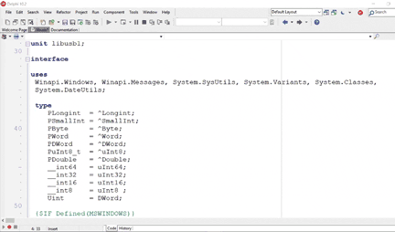
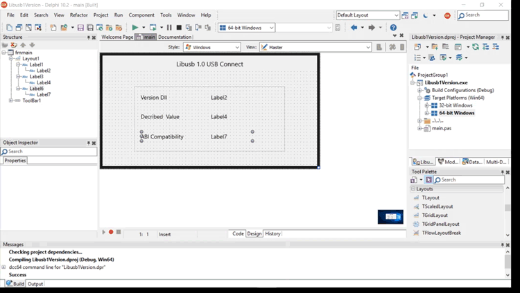
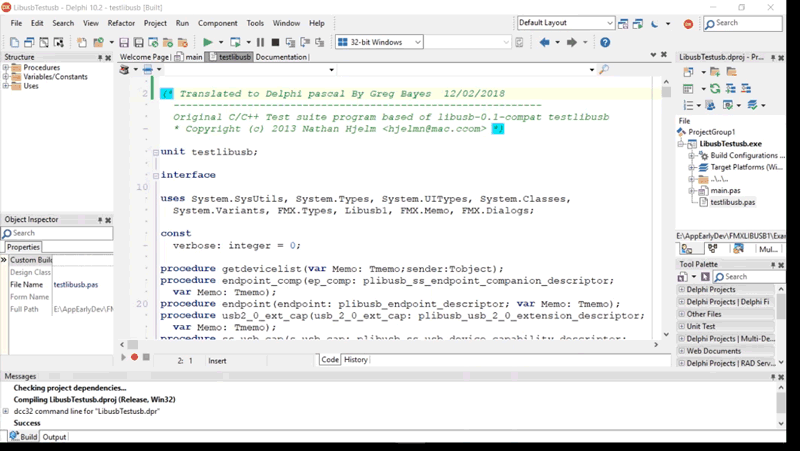
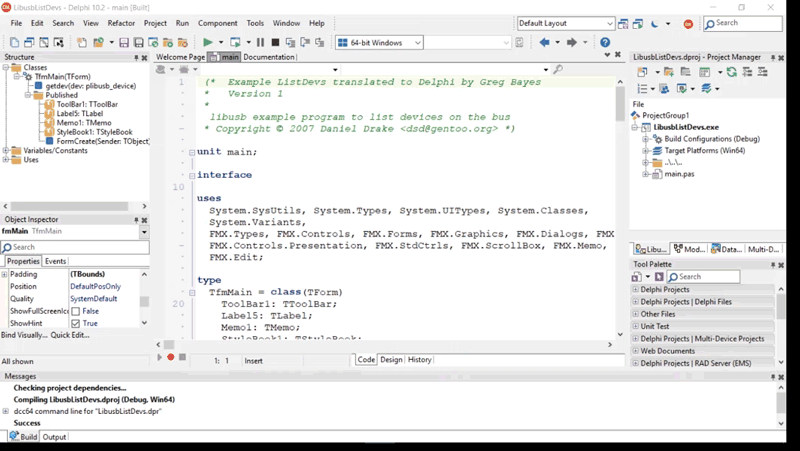

**The Delphi Development**

Libusb 1.0 is open source C library that provides generic communication to USB
devices and is widely used on Windows, OSX and Linux Platforms’. Libusb 1.0
supports USB 3.1 and is backwards compatible with USB 2.0 and USB 1.0.

It features the following:-

-   Supports all transfer types such as (control / bulk / interrupt /
    isochronous),

-   Supports two transfer interfaces.

    -   Synchronous(simple).

    -   Asynchronous(more complicated but more powerful).

-   Thread safe.

-   Lightweight with a lean API.

-   Supports hotplug capability.

This is a Full Delphi header translation of the Libusb.h file available for both
VCL and FMX Windows 32bit and 64bit only.

This supports the DLL Version 1.0.17 and up.

**Testing on your IDE**

Examples are created in both FMX and VCL for your usage ( created on Tokyo
10.2.3) and should be backwards compatible to Unicode versions in VCL and early
FMX versions.

Examples available :-

-   DLL Version

-   Test LibUSB

-   ListDevs

-   Bulk Transfer

Open the Example ‘DLL Version’ 32bit or 64bit and run the project. This will
show the DLL version and show that all is running correctly.

**Using LibUSB in your Application**

Open a new application in your IDE. Add the libusb1 to the project and add the
libusb1 library to the users list. Add the correct DLL to the application EXE
folder. Normally in the folder structure Win32/Debug/libusb/libusb-1.0.dll or
Win64/Debug/libusb/libusb-1.0.dll. Place the correct DLL in the correct folder
as they are not interchangeable. The 32bit DLL shares the same name as the 64bit
DLL.

**Recent Changes**

-   Changed example Bulk Transfer various errors 06/05/2018

-   Changed example Arduino Transfer various errors 06/05/2018

-   Changed Libusb1 library various 06/04/2018

    -   libusb_interface

        -   altsetting: array of plibusb_interface_descriptor;

-   Changed Libusb1 library various 21/02/2018

    -   libusb_interface_descriptor

        -   endpoint: array of plibusb_endpoint_descriptor

        -   &interface: array of plibusb_interface;

-   Completed and tested the TestLibusb.

>   **Examples in Development**

The following are in development and will be added one by one after testing

-   Asynchronous Transfer

-   EZUSB

-   FxLoad

-   Hotplug Test

-   Synchronous Transfer

-   xUSB

-   DPFP

-   Bulk Transfer Arduino
